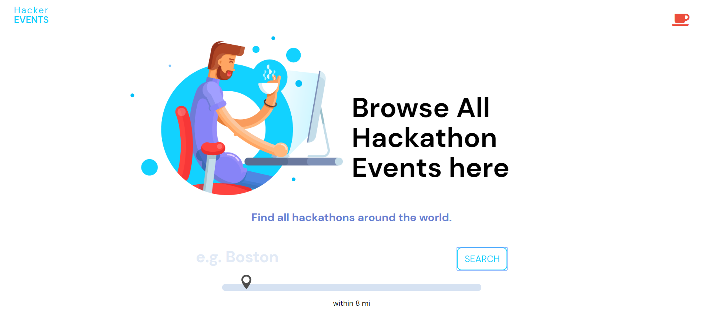

# Hacker-Events

## Link: 
[Hacker Events](https://alexandrakollarova.github.io/Hacker-Events/)

## Description:
A cool place to search for hackathons around the world. Allow the browser to use your location and hit Search and/or can modify your search using the slider range. Search for hackathon events in any city, state or country in the world!

## In action:

### Home Page

### Answer CSS Questions

#### Earn Points: 
Each question worths 10 points

### Search Hackathon Events 

### Get Inspired - Watch Hackathon Videos on YouTube 

## Tech Used:
* JavaScript
* jQuery
* HTML
* CSS

